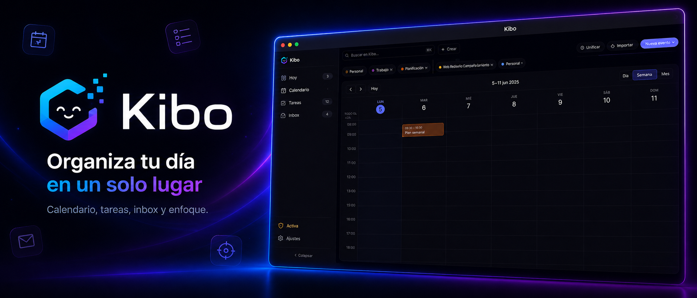

# Kibo

  

> Tu día, tu semana y tu foco — en una sola app.

  <a href="https://kibo.markox.dev">🌐 Probar en la web</a>
  &nbsp;·&nbsp;
  <a href="https://github.com/Markox36/kibo_app/releases">⬇️ Descargar última versión</a>

Kibo es una app de productividad personal que combina **calendario**, **tareas**, **notas rápidas** y **modo concentración** en un flujo único. Pensada para quienes viven pegados al calendario pero no quieren doce herramientas distintas para organizarse.

---

## ¿Para quién es?

- **Profesionales y creadores** que necesitan bloquear tiempo real para tareas, no solo listarlas.
- **Estudiantes** que combinan clases, entregas y estudio en la misma vista.
- **Freelance / autónomos** que quieren separar contexto de trabajo por categorías y calendarios.
- Cualquiera que use Google Calendar y quiera algo más ligero encima.

---

## Lo que hace Kibo

### Pantalla Hoy

- Saludo dinámico, fecha larga y reloj a la vista.
- Anillo de progreso con las tareas del día hechas vs pendientes.
- Chips de estado: próximo evento (con cuenta atrás), tareas atrasadas, inbox pendiente.
- Agenda del día con línea "AHORA" en tiempo real, eventos y tareas mezclados.
- Panel de tareas con tabs Hoy / Atrasadas, quick-add inline, checkbox para completar.
- Todo en un solo vistazo, sin scrollear entre pantallas.

### Calendario

- Vistas **día · 3 días · semana · mes** que cambian solas según el ancho de pantalla.
- Drag & drop de eventos y tareas al bloque horario.
- Resize para ajustar duración con el ratón.
- Eventos recurrentes (RRULE).
- Filtros por tipo (eventos, tareas planificadas, vencimientos) y por calendario.
- Click en cualquier elemento → **modal de detalle** con toda la info y botón lápiz para editar.
- Colores por calendario configurables.

### Tareas

- Prioridades **P1 / P2 / P3** con código de color.
- Planificación con fecha + hora (bloqueada en calendario) o solo fecha.
- Vencimiento independiente de la planificación.
- Estimación en minutos.
- **Subtareas** con progreso.
- Categorías y etiquetas.
- Nivel de energía por tarea (útil para picking según el momento del día).

### Inbox

- Captura rápida sin fricción — anota ideas, luego las procesás.
- Contador visible siempre para no olvidarlas.

### Modo Concentración

- **Pomodoro** configurable (trabajo / descanso corto / descanso largo / ciclos).
- Timer **custom** aparte para sesiones libres.
- Panel dedicado con controles play / pause / stop / skip.
- Player **lofi integrado** para trabajar con música ambient.

### Notificaciones y recordatorios

- Recordatorios de eventos y tareas con tiempo de aviso previo configurable.
- Toggle independiente para eventos, tareas planificadas y vencimientos.
- Usa notificaciones nativas del sistema operativo.

### Integraciones

- **Google Calendar**: conectá tu cuenta, importá calendarios y eventos con un click. Sync automático, tokens cifrados en servidor.
- **ICS**: importá desde archivo o URL, exportá tu calendario Kibo a `.ics` estándar.

### Papelera

- Los elementos borrados van a la papelera con opción de restaurar.
- Vaciado manual o purga automática por antigüedad.

### Backup

- Export / import en JSON plano.
- Export en **CSV** por tipo de entidad.
- **Backup cifrado con passphrase** (AES-GCM + Argon2) para pasar datos entre dispositivos de forma segura.

### Ajustes

- Zoom de la interfaz con `Ctrl + / - / 0` o `Ctrl + rueda`.
- Ajustes de notificaciones granulares.
- Presets de pomodoro personalizables.
- Sidebar colapsable con atajos de teclado.
- Papelera y limpieza automática.

---

## Plataformas

- 🖥️ **Escritorio**: Linux (.deb / .AppImage / .rpm), macOS y Windows. Descargas en [Releases](https://github.com/Markox36/kibo_app/releases).
- 🌐 **Web**: [kibo.markox.dev](https://kibo.markox.dev) — cualquier navegador moderno.
- Interfaz responsive de móvil a monitor 4K.
- Modo oscuro por defecto (claro llega en próxima versión).

---

## ¿Qué diferencia a Kibo?

- **Todo en la misma vista**: no saltás entre "app de tareas" y "app de calendario". Están fusionados.
- **Timeline con "AHORA"**: sabés dónde estás en tu día de un vistazo.
- **Diseño limpio**: sin publicidad, sin distracciones, sin cinco menús anidados.
- **Rápido**: hecho con tecnologías nativas modernas, sin Electron pesado.
- **Datos tuyos**: podés exportar todo cuando quieras, en cualquier formato.
- **Un solo login** para desktop y web — todo sincronizado.

---

## Seguridad

- Conexión TLS end-to-end.
- Autenticación con **JWT** de acceso corto + refresh con rotación y detección de reuso.
- Login por email/contraseña con verificación por email o con **Google Sign-In** (OAuth 2.0 + PKCE).
- Contraseñas hasheadas con Argon2.
- Backups cifrados en cliente.
- Content Security Policy estricta en la app desktop.

---

## Requisitos

- **Desktop Linux**: distribución con `webkit2gtk 4.1`, `gtk3`, `libayatana-appindicator`.
- **Desktop macOS**: 11+.
- **Desktop Windows**: 10+ con WebView2.
- **Web**: Chrome / Firefox / Safari / Edge recientes.

---

## Estado del proyecto

Versión actual: **0.1.0** (early access).

Próximo en el horizonte:

- Tema claro.
- Integración con Outlook / iCloud Calendar.
- Vista Kanban de tareas.
- App móvil nativa (iOS + Android).
- Compartir workspaces entre varios usuarios.

---

## Contacto

Kibo · desarrollado por **Markox** · [hello@markox.dev](mailto:hello@markox.dev)

Código cerrado. Todos los derechos reservados © 2026.
